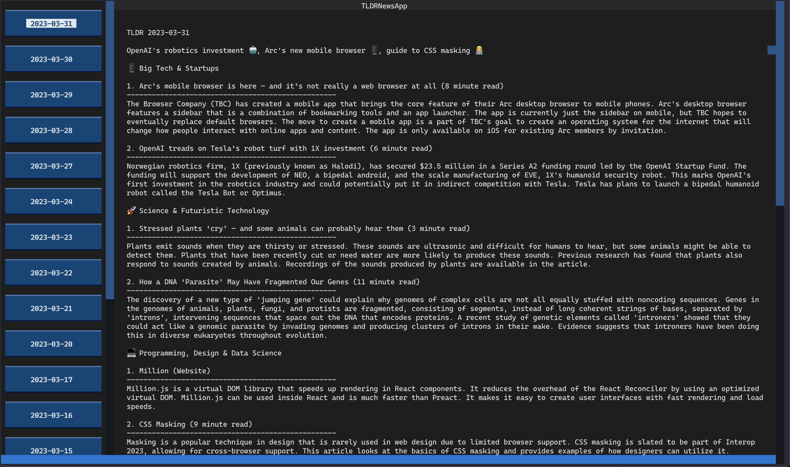

## TLDR News Terminal

This is a simple terminal application that shows the latest tech news headlines from the [TLDR Newsletter](https://tldr.tech/).

The application is written in Python, uses the [BeautifulSoup](https://www.crummy.com/software/BeautifulSoup/bs4/doc/) library to parse the HTML content of the newsletter and uses [Textual](textual.textualize.io/) library to render the content in the terminal.



### <b>Usage</b>

```bash
pip install tldr_news
```

### <b>Installation</b>

To install the application, simply run the following command after cloning the repository:

1. Install dependencies

```bash
poetry install && poetry shell
```

2. Run the application

```bash
poetry run tldr_news
```

### <b>DISCLAIMER</b>

This is not an official TLDR Newsletter product, but a personal project coming from my love with this newsletter. I am not affiliated with TLDR Newsletter in any way.

All the newsletter content is owned by TLDR Newsletter and I am not responsible for any of the content.
